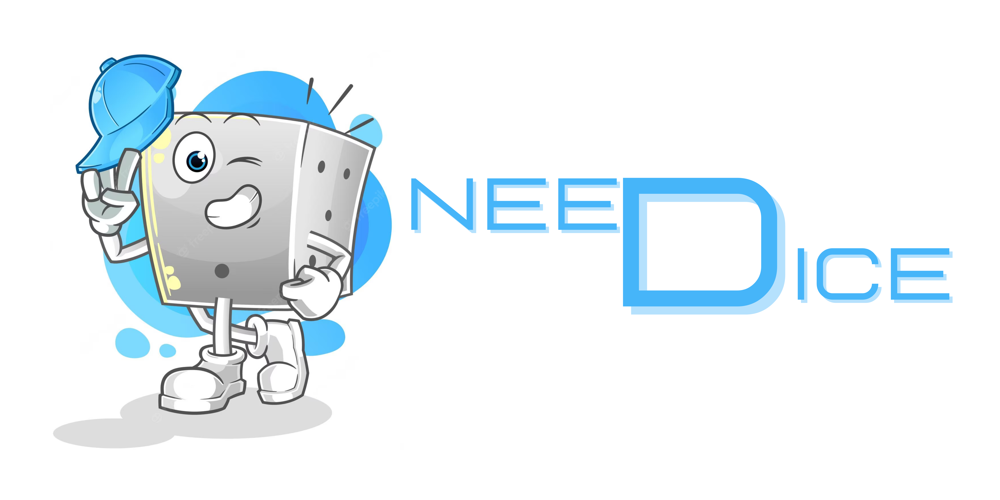

   

# **NEEDICE**

## Bonjour et bienvenue sur le dépôt du projet NEEDICE ! 👋

*******

Sommaire 
 1. [Accessibilité](#acces)
 2. [Progression](#progression)
 3. [Présentation du projet](#presentation)
 4. [Contenu](#contenu)
 5. [Contraintes](#contraintes)
 6. [Conception](#conception)
 7. [Auteurs](#auteurs)

*******

### Profiter dès maintenant d'un accès anticipé à SpellTastic

Disponible sur :  
   

> **Warning**: Le déploiement n'a pas encore été fait. 

*******

🚧  __EN PROGRESSION__

📆  _Fin du projet prévue :_ 03 Avril 2023

Retrouver notre avancée journalière dans la partie `wiki` de notre dépôt.   

*******

### **Présentation**

NeeDice : votre lanceur de dé personnalisable !  
Lancer de dé fait par le mouvement de votre téléphone.  

*******

## Contraintes

|**Liste des contraintes imposées par le corps enseignant**|
|-----|
|Je sais utiliser les Intent comme composant de communication au sein de mon application|
|Je sais développer en utilisant le SDK le plus bas possible|
|Je sais distinguer mes ressources en utilisant les qualifier|
|Je sais faire des vues xml en utilisant layouts et composants adéquats|
|Je sais coder proprement mes activités, en m’assurant qu’elles ne font que relayer les évènements|
|Je sais coder une application en ayant un véritable métier|
|Je sais parfaitement séparer vue et modèle|
|Je maîtrise le cycle de vie de mon application|
|Je sais utiliser le findViewById à bon escient|
|Je sais gérer les permissions dynamiques de mon application|
|Je sais gérer la persistance légère de mon application|
|Je sais gérer la persistance profonde de mon application|
|Je sais afficher une collection de données|
|Je sais coder mon propre adaptateur|
|Je maîtrise l’usage des fragments|
|Je sais consommer un service web|
|Je sais développer une application sans utiliser de librairies externes sauf accord de l’enseignant|
|Je sais développer une application publiable sur le store.|
|Je sais utiliser l’accéléromètre et ou le gyroscope|

*******

## Fonctionnalités

- Personnalisation de la couleur et du nombre de faces de dé.   
- Lancement de dé fait avec l'accéléromètre.   
- Annonce du résultat par la sortie audio du smartphone.  

- D'autres fonctionnalités supplémentaires sont aussi envisagées...

*******

## Ressources

- Temps
    - 27 Février au 31 Mars    
- Matériel
    - Ordinateurs portables sous Linux ou Windows   
    - Android Studio    
- Langages utilisés
    -  
- Personnes 
    - 2 étudiants en BUT Informatique

*******

## Détails de conception

> **Warning**: Pas encore disponibles.

*******

## Auteurs

Étudiant 2ème Annnée - BUT Informatique - IUT Clermont Auvergne - 2022-2023   
`BRODA Lou` - `ANDRE Flavien`
